# Backend — Low-Level Design

> FastAPI + SQLAlchemy + PostgreSQL + asyncio — all business logic in OOP classes, each module exporting a module-level singleton instance.

---

## Table of Contents

1. [Module Structure](#1-module-structure)
2. [Class Hierarchy](#2-class-hierarchy)
3. [Core Layer](#3-core-layer)
4. [Auth Layer](#4-auth-layer)
5. [Data Layer](#5-data-layer)
6. [Screener Layer](#6-screener-layer)
7. [Analysis Layer](#7-analysis-layer)
8. [Portfolio Layer](#8-portfolio-layer)
9. [Risk Layer](#9-risk-layer)
10. [Alerts Layer](#10-alerts-layer)
11. [Scheduler Layer](#11-scheduler-layer)
12. [API Layer](#12-api-layer)
13. [Database Schema](#13-database-schema)
14. [ER Diagram](#14-er-diagram)
15. [Python Concepts Map](#15-python-concepts-map)
16. [Design Patterns](#16-design-patterns)

---

## 1. Module Structure

```
backend/app/
├── core/
│   ├── settings.py        Settings (Pydantic BaseSettings singleton)
│   ├── database.py        Engine, SessionLocal, managed_session(), get_db()
│   └── exceptions.py      TradingAgentError hierarchy
├── models/
│   └── db_models.py       SQLAlchemy ORM table classes
├── schemas/
│   └── responses.py       Pydantic response/request schemas
├── auth/
│   ├── schemas.py         Auth request/response Pydantic models
│   ├── service.py         AuthService (passwords, TOTP, JWT)
│   ├── dependencies.py    get_current_user FastAPI dependency
│   └── router.py          /auth/* endpoints
├── universe/
│   └── sectors.py         SECTORS dict, ALL_TICKERS, TICKER_SECTOR
├── data/
│   ├── fetcher.py         PriceDataFetcher + OHLCVBar dataclass
│   ├── news_fetcher.py    NewsFetcher + NewsArticle dataclass
│   └── robinhood_reader.py RobinhoodReader
├── screener/
│   ├── technical.py       BaseScreener (ABC) + TechnicalAnalyzer + SignalSnapshot
│   ├── peg_scanner.py     PegScanner + PegCandidate
│   └── base_detector.py   BaseDetector
├── analysis/
│   ├── stage_analyzer.py  StageAnalyzer
│   ├── scoring.py         UniverseScorer + TickerScore + SectorLeader
│   └── claude_analyzer.py BaseAnalyzer (ABC) + ClaudeAnalyzer (async)
├── portfolio/
│   ├── tracker.py         PortfolioTracker + PositionMetrics
│   └── alpaca_sync.py     AlpacaSync + AccountSnapshot
├── risk/
│   ├── position_sizer.py  PositionSizer + TranchePlan
│   ├── exposure.py        ExposureCalculator + ExposureReport
│   └── stop_manager.py    StopManager + SellSignal + SignalType + Severity
├── alerts/
│   ├── notifier.py        SlackNotifier (tenacity retries)
│   └── daily_briefing.py  DailyBriefing (dependency-injected)
├── scheduler/
│   └── jobs.py            TradingScheduler (APScheduler + deque history)
├── api/v1/
│   ├── router.py          APIRouter assembly + JWT protection
│   └── endpoints/         One file per domain
└── main.py                FastAPI app + lifespan
```

---

## 2. Class Hierarchy

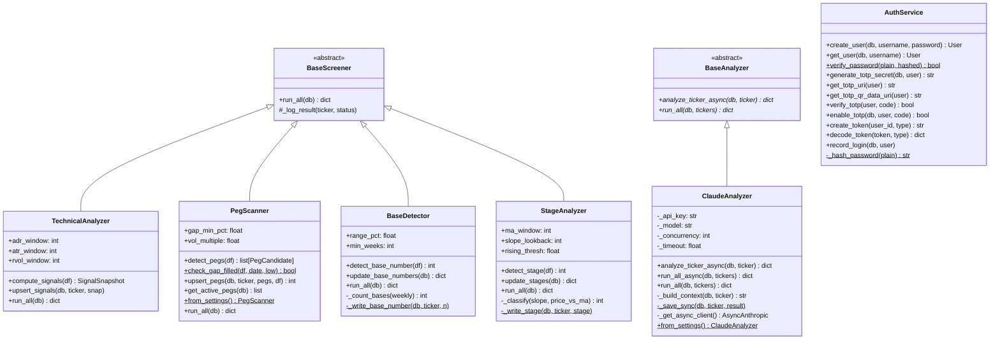

---

## 3. Core Layer

### `settings.py` — `Settings(BaseSettings)`

Loads all configuration from environment / `.env` files. Singleton `settings` is imported everywhere — no raw `os.getenv()` calls exist in the codebase.

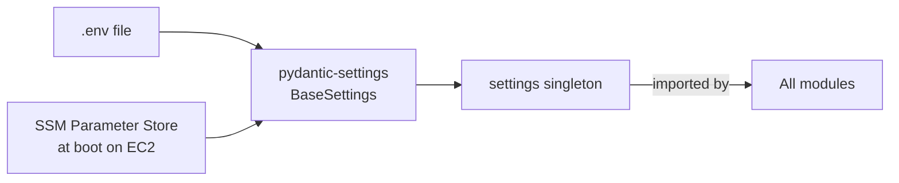

**Key groups:**

| Group | Key fields |
|---|---|
| API keys | `anthropic_api_key`, `finnhub_api_key`, `alpaca_api_key` |
| Auth | `jwt_secret_key`, `jwt_access_token_expire_minutes` (30), `totp_issuer` |
| Trading rules | `peg_gap_min_pct` (3.0), `adr_min` (3.0), `adr_max` (10.0) |
| Risk limits | `max_sector_exposure_pct` (40%), `max_position_pct` (10%) |
| Claude | `claude_concurrency` (5), `claude_timeout_sec` (30.0), `claude_model` |

**`@computed_field`** — `rh_enabled` is derived from three credential fields, not a stored env var.

### `database.py` — Session Management

```python
# FastAPI dependency (generator)
def get_db() -> Generator[Session, None, None]:
    db = SessionLocal()
    try:    yield db
    finally: db.close()

# Scheduler / scripts (context manager)
@contextmanager
def managed_session() -> Generator[Session, None, None]:
    db = SessionLocal()
    try:    yield db; db.commit()
    except: db.rollback(); raise
    finally: db.close()
```

Connection pool: `pool_size=5`, `max_overflow=10`, `pool_pre_ping=True`.

### `exceptions.py` — Exception Hierarchy

```
TradingAgentError(Exception)
├── DataFetchError       — external API failure
│   └── RateLimitError   — HTTP 429, carries retry_after
├── AnalysisError        — Claude API / JSON parse failure
├── SyncError            — Alpaca / Robinhood sync failure
├── NotificationError    — Slack delivery failure
├── DatabaseError        — unrecoverable DB error
└── ConfigurationError   — missing/invalid config (e.g. creating second user)
```

---

## 4. Auth Layer

### Flow

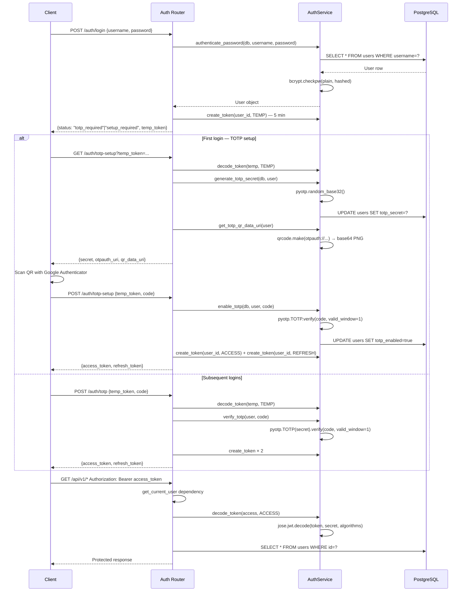

### JWT Token Types

| Type | Expiry | Purpose |
|---|---|---|
| `temp` | 5 minutes | Issued after password OK, before TOTP |
| `access` | 30 minutes | Authorises all protected API calls |
| `refresh` | 7 days | Used to get new access + refresh pair |

All tokens contain `{sub: user_id, type: token_type, exp: unix_timestamp}`, signed with HS256.

### `AuthService` Key Methods

| Method | What it does |
|---|---|
| `create_user(db, username, password)` | bcrypt hash + INSERT users (one-time only) |
| `authenticate_password(db, username, password)` | Lookup + `bcrypt.checkpw` |
| `generate_totp_secret(db, user)` | `pyotp.random_base32()` → store in DB |
| `get_totp_qr_data_uri(user)` | `qrcode.make(otpauth_uri)` → base64 PNG |
| `verify_totp(user, code)` | `pyotp.TOTP(secret).verify(code, valid_window=1)` |
| `enable_totp(db, user, code)` | Verify + set `totp_enabled=True` |
| `create_token(user_id, type)` | Sign HS256 JWT with type-appropriate expiry |
| `decode_token(token, expected_type)` | Decode + type-check (raises JWTError) |

---

## 5. Data Layer

### `PriceDataFetcher`

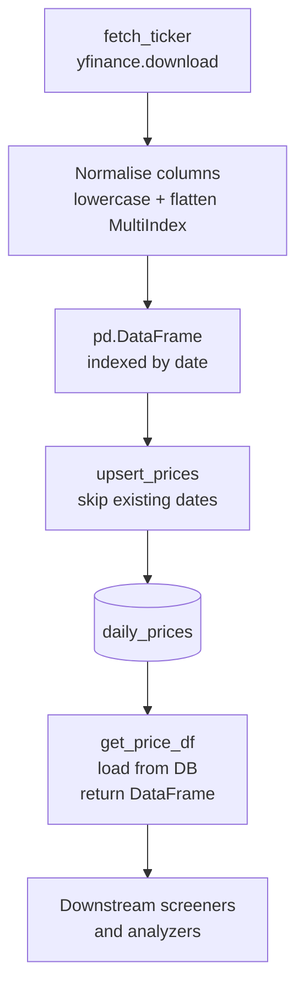

**`_iter_bars(ticker, df)`** — generator that yields `OHLCVBar` dataclass instances row-by-row. Never builds the full list in memory.

**`_to_dict_gen(rows)`** — generator that converts ORM rows to plain dicts for `pd.DataFrame()` constructor.

**`update_all_prices(db)`** — catches `DataFetchError` per ticker so one failed download doesn't abort the batch. Returns `{ticker: {rows, status}}` dict.

### `NewsFetcher`

```mermaid
flowchart TD
    FN[fetch_news] --> RET[_fetch_with_retry\n@tenacity.retry\n3 attempts\n2→4→8s backoff]
    RET --> FH[Finnhub API\ncompany_news]
    FH --> P[_parse_article\nNewsArticle dataclass]
    P --> UN[upsert_news\npre-load URL set\nO1 dedup]
    UN --> DB[(news_items)]
```

**Tenacity decorator on `_fetch_with_retry`:**
```python
@retry(
    retry=retry_if_exception_type(DataFetchError),
    stop=stop_after_attempt(3),
    wait=wait_exponential(min=2, max=30),
    before_sleep=before_sleep_log(logger, WARNING),
)
```
HTTP 429 → raises `RateLimitError(DataFetchError)` → triggers retry.

---

## 6. Screener Layer

All four screeners extend `BaseScreener(ABC)` which enforces `run_all(db)` and provides `_log_result()`.

### `TechnicalAnalyzer` — Indicator Computation

| Indicator | Formula | Significance |
|---|---|---|
| EMA 9 | 9-period EWM (adjust=False) | Short-term momentum, entry signal |
| EMA 21 | 21-period EWM | Medium-term trend, add signal |
| SMA 50 | 50-period rolling mean | 10-week support (O'Neil) |
| SMA 200 | 200-period rolling mean | Long-term trend direction |
| MA 10W | 50-day MA | Same as SMA50, aliased |
| MA 30W | 150-day MA | Weinstein 30-week line |
| ADR % | mean(high−low)/low × 100, 14-day | Sweet spot: 3–10% |
| ATR | mean(true_range), 14-day | Position sizing input |
| ATR Extension | (close − SMA50) / ATR | Overextension: > 3× = consider trim |
| RVOL | today_volume / 20d_avg_vol | Accumulation signal: > 1.5× |

**`SignalSnapshot` dataclass:** Holds all 10 values for a single `(ticker, date)`. Passed directly to `upsert_signals()`.

### `PegScanner` — PEG Detection

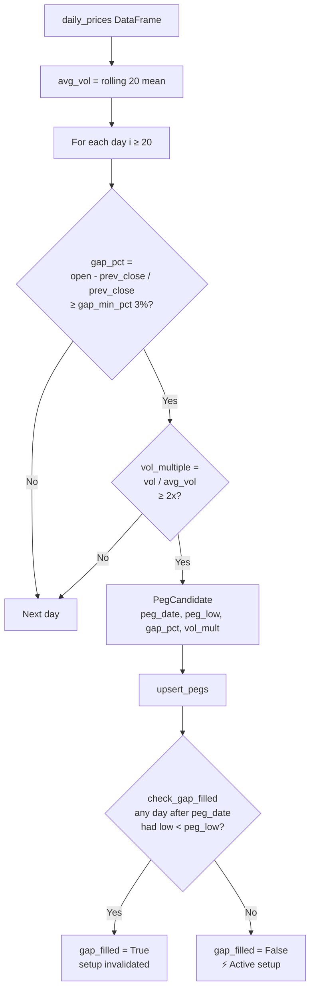

`check_gap_filled` is a `@staticmethod` — no instance state needed.

### `BaseDetector` — Base Counting

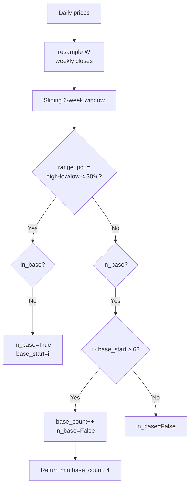

### `StageAnalyzer` — Weinstein Classification

```python
ma_slope_pct = (current_ma - prev_ma_10_periods_ago) / prev_ma × 100

if ma_slope_pct > +0.5 and price_vs_ma > 0:  return 2  # Uptrend
if ma_slope_pct < -0.5 and price_vs_ma < 0:  return 4  # Downtrend
if abs(ma_slope_pct) ≤ 0.5:
    return 1 if -5 < price_vs_ma < 5 else 3   # Basing or Topping
return 3                                        # Default topping
```

---

## 7. Analysis Layer

### `UniverseScorer` — Scoring Logic

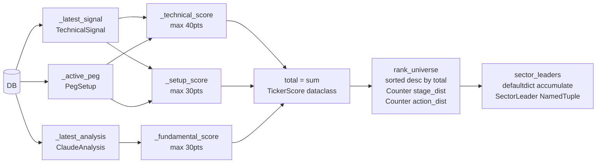

**Score breakdown:**

| Sub-score | Points | Conditions |
|---|---|---|
| Technical | 5 ea | price > SMA200, price > SMA50, price > EMA21, price > EMA9 |
| Technical | 5 | ADR 3–10% |
| Technical | 5 | ATR extension < 2× |
| Technical | 5 | RVOL > 1.5× |
| Technical | 5 | Stage 2 |
| Setup | 15 | Active unfilled PEG |
| Setup | 10 | Base #1 or #2 |
| Setup | 5 | EMAs tight around SMA50 (< 5% deviation) |
| Fundamental | 0–30 | Claude conviction/10 × 30 |

### `ClaudeAnalyzer` — Async Architecture

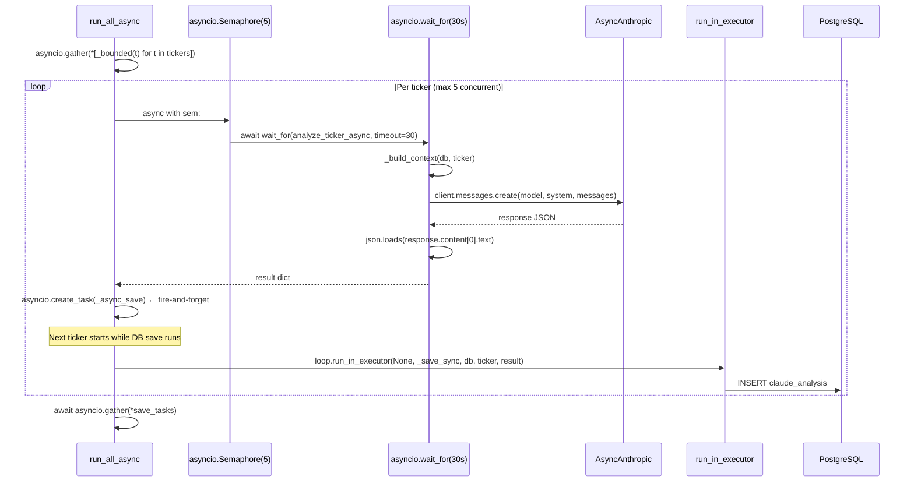

**`_build_context`** assembles the prompt from:
- Latest `TechnicalSignal` row (stage, base, MAs, ADR, ATR, RVOL)
- Most recent unfilled `PegSetup`
- Last 5 `NewsItem` headlines (7-day window)

**`run_all()`** is the sync bridge for the scheduler:
```python
def run_all(self, db, tickers=None):
    return asyncio.run(self.run_all_async(db, tickers or ALL_TICKERS))
```
`asyncio.run()` creates a new event loop per thread — safe to call from APScheduler's background threads even when FastAPI's loop is running in the main thread.

---

## 8. Portfolio Layer

### `PortfolioTracker`

`PositionMetrics` dataclass is the single place all P&L maths lives:

```python
@classmethod
def compute(cls, ticker, shares, avg_cost, current_price, ...) -> PositionMetrics:
    market_value   = shares × current_price
    unrealized_pnl = (current_price − avg_cost) × shares
    unrealized_pct = (current_price − avg_cost) / avg_cost × 100
```

`upsert_position()` creates `PositionMetrics` first, then either creates a new DB row or updates the existing one. Never duplicates position rows.

### `AlpacaSync`

`AccountSnapshot` dataclass wraps the Alpaca SDK `Account` object and exposes `daily_change` and `daily_pct` as `@property` computations.

```mermaid
flowchart LR
    AL[Alpaca TradingClient] --> POS[get_all_positions]
    AL --> ACC[get_account]
    POS --> UP[upsert_position × N]
    ACC --> SN[AccountSnapshot\n@property daily_change\n@property daily_pct]
    SN --> SNAP[snapshot_portfolio]
```

---

## 9. Risk Layer

### `StopManager` — Signal Types

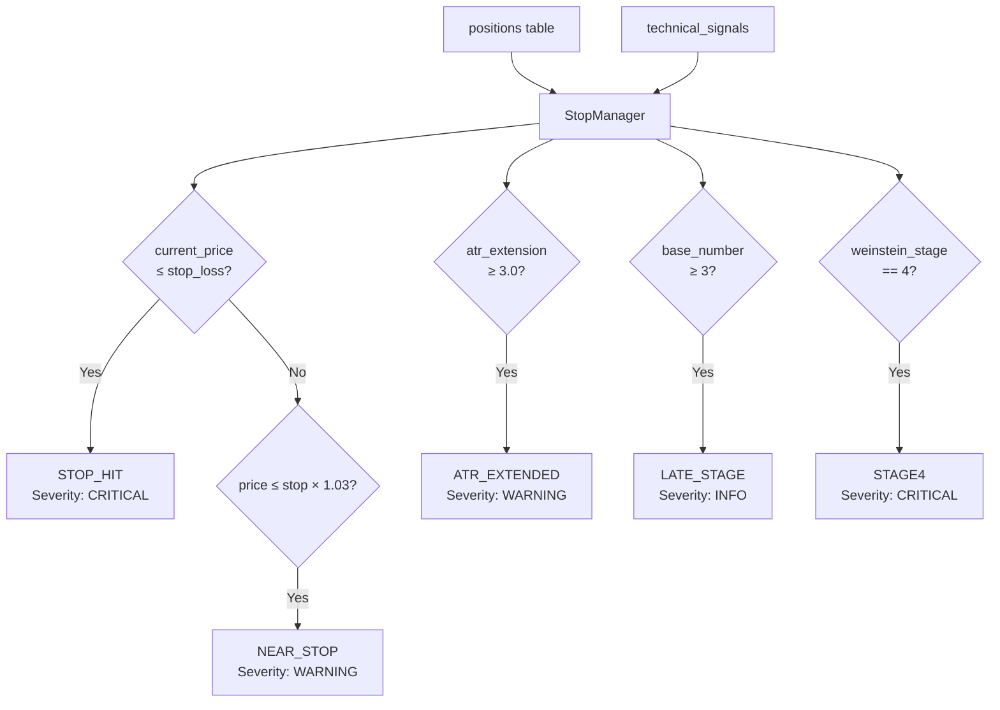

`SignalType` and `Severity` are `str, Enum` — values serialize to plain strings in JSON without extra marshalling.

### `ExposureCalculator`

Uses `defaultdict(float)` to accumulate market value per sector in a single pass:

```python
sector_vals: defaultdict[str, float] = defaultdict(float)
for p in positions:
    sector_vals[p.sector] += float(p.market_value or 0)
```

`_sector_warnings()` is a **generator** — yields warning strings only for breached limits, avoiding building an intermediate list.

### `PositionSizer`

```python
# Two-tranche entry
tranche1 = portfolio × 5%  / entry_price  # shares
tranche2 = portfolio × 5%  / entry_price  # shares
max_pos  = portfolio × 10% / entry_price  # total cap

# Stop calculation static methods
calc_stop_from_peg(peg_low, buffer=0.01)   → peg_low × 0.99
calc_stop_from_sma50(sma50, buffer=0.02)   → sma50 × 0.98
```

---

## 10. Alerts Layer

### `SlackNotifier` — Tenacity Retry

```mermaid
flowchart TD
    SEND[send channel_key, text] --> LK{channel_key\nin channel_map?}
    LK -- No --> ERR[log error\nreturn False]
    LK -- Yes --> RTY[_post_with_retry\n@tenacity retry]
    RTY --> P[requests.post\nslack.com/api/chat.postMessage]
    P --> R{result.ok?}
    R -- Yes --> OK[return True]
    R -- No --> NE[raise NotificationError]
    NE --> RTY
    RTY -->|after 3 attempts| FAIL[log error\nreturn False]
```

**Tenacity configuration:** `stop_after_attempt(3)`, `wait_exponential(min=2, max=30)`, `before_sleep_log`.

Never raises — always returns `bool`. Alert failures never crash the pipeline.

### `DailyBriefing` — Dependency Injection

All five dependencies passed via constructor:
```python
DailyBriefing(
    notifier=slack_notifier,
    scorer=universe_scorer,
    tracker=portfolio_tracker,
    exposure_calc=exposure_calculator,
    stop_mgr=stop_manager,
    peg_scan=peg_scanner,
)
```

`generate(db)` uses:
- `Counter` for severity distribution of sell signals
- `defaultdict(list)` for sector → headlines grouping

`from_singletons()` `@classmethod` wires production singletons. Tests can inject mocks.

---

## 11. Scheduler Layer

### `TradingScheduler` — Job Architecture

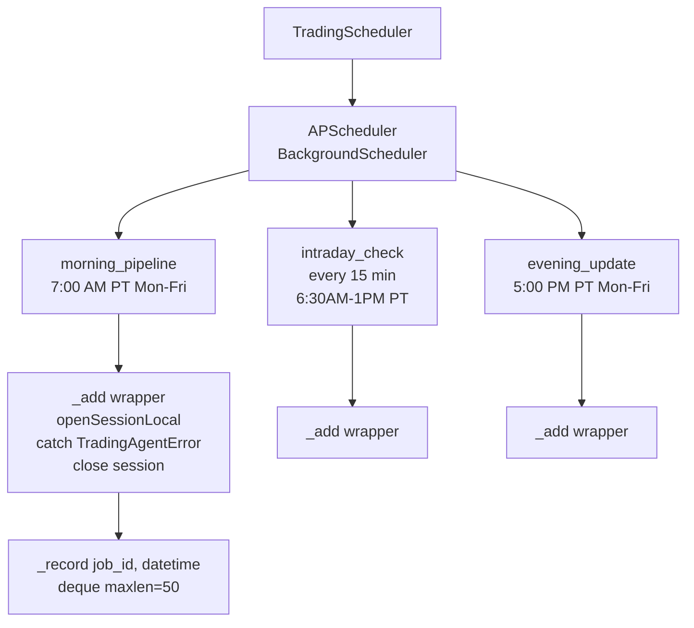

**`deque(maxlen=50)`** — bounded run history. `last_run(job_id)` scans in reverse for the most recent entry. Auto-evicts oldest when full.

**`_add(job_id, fn, trigger)`** — private factory that wraps every job in a closure with:
1. `SessionLocal()` creation
2. `fn(db, *args, **kwargs)` call
3. `_record(job_id)` on success
4. `TradingAgentError` catch + log
5. Bare `Exception` catch + log (never propagates)
6. `db.close()` in `finally`

---

## 12. API Layer

### Route Protection

```python
_auth = {"dependencies": [Depends(get_current_user)]}

api_router.include_router(auth_router)                  # Public /auth/*
api_router.include_router(portfolio.router, **_auth)    # Protected
api_router.include_router(screener.router,  **_auth)    # Protected
# ... all other routers protected
```

`get_current_user` dependency:
1. Extracts `Authorization: Bearer <token>` via `OAuth2PasswordBearer`
2. Calls `auth_service.decode_token(token, TokenType.ACCESS)`
3. Fetches `User` by id from DB
4. Raises `HTTP 401` if any step fails

### Endpoint Reference

| Method | Path | Auth | Description |
|---|---|---|---|
| POST | `/auth/login` | None | Password → temp_token |
| GET | `/auth/totp-setup` | temp_token | Generate QR code |
| POST | `/auth/totp-setup` | temp_token | Verify + enable TOTP |
| POST | `/auth/totp` | temp_token | Verify code → JWT |
| POST | `/auth/refresh` | refresh_token | New access + refresh pair |
| GET | `/auth/me` | JWT | Current user profile |
| GET | `/api/v1/portfolio/summary` | JWT | Totals: value, P&L, cash |
| GET | `/api/v1/portfolio/holdings` | JWT | All open positions |
| GET | `/api/v1/portfolio/performance` | JWT | Equity curve `?period=1M` |
| GET | `/api/v1/portfolio/sector-allocation` | JWT | Sector % + warnings |
| POST | `/api/v1/portfolio/robinhood-sync` | X-Sync-Key | Robinhood bridge |
| GET | `/api/v1/screener/ranked` | JWT | Universe sorted by score |
| GET | `/api/v1/analysis/{ticker}` | JWT | Latest Claude analysis |
| POST | `/api/v1/analysis/{ticker}/refresh` | JWT | Trigger new Claude call |
| GET | `/api/v1/peg/active` | JWT | Unfilled PEG setups |
| GET | `/api/v1/peg/history` | JWT | Last 50 PEGs |
| GET | `/api/v1/movers/top` | JWT | Top gainers + losers |
| GET | `/api/v1/movers/unusual-volume` | JWT | RVOL > threshold |
| GET | `/api/v1/news/feed` | JWT | Filtered news |
| GET | `/api/v1/alerts/active` | JWT | Undismissed alerts |
| POST | `/api/v1/alerts/{id}/dismiss` | JWT | Dismiss alert |
| GET | `/api/v1/system/health` | JWT | DB connectivity |
| POST | `/api/v1/system/run-pipeline` | JWT | Manual pipeline trigger |
| GET | `/api/v1/system/pipeline-status` | JWT | Pipeline running? |

---

## 13. Database Schema

### `users`

| Column | Type | Notes |
|---|---|---|
| `id` | SERIAL PK | |
| `username` | VARCHAR(50) UNIQUE | Login name |
| `hashed_password` | VARCHAR | bcrypt hash |
| `totp_secret` | VARCHAR | NULL until TOTP setup |
| `totp_enabled` | BOOLEAN | False until first TOTP verify |
| `is_active` | BOOLEAN | Soft disable |
| `created_at` | TIMESTAMP | Auto |
| `last_login` | TIMESTAMP | Updated on each successful TOTP verify |

### `daily_prices`

| Column | Type | Notes |
|---|---|---|
| `id` | SERIAL PK | |
| `ticker` | VARCHAR(10) | Indexed |
| `date` | DATE | Indexed. UNIQUE with ticker |
| `open` `high` `low` `close` | NUMERIC(12,4) | |
| `volume` | BIGINT | |
| `adj_close` | NUMERIC(12,4) | |

### `technical_signals`

| Column | Type | Notes |
|---|---|---|
| `id` | SERIAL PK | |
| `ticker` | VARCHAR(10) | Indexed |
| `date` | DATE | UNIQUE with ticker |
| `ema9` `ema21` | NUMERIC(12,4) | |
| `sma50` `sma200` | NUMERIC(12,4) | |
| `ma10w` `ma30w` | NUMERIC(12,4) | |
| `adr_pct` | NUMERIC(8,4) | |
| `atr` | NUMERIC(12,4) | |
| `atr_extension` | NUMERIC(8,4) | |
| `rvol` | NUMERIC(8,4) | |
| `weinstein_stage` | SMALLINT | 1–4, set by StageAnalyzer |
| `base_number` | SMALLINT | 0–4, set by BaseDetector |

### `peg_setups`

| Column | Type | Notes |
|---|---|---|
| `id` | SERIAL PK | |
| `ticker` | VARCHAR(10) | Indexed |
| `peg_date` | DATE | UNIQUE with ticker |
| `peg_low` | NUMERIC(12,4) | Key support level |
| `gap_pct` | NUMERIC(8,4) | |
| `volume_multiple` | NUMERIC(8,4) | |
| `gap_filled` | BOOLEAN | Updated daily |
| `created_at` | TIMESTAMP | Auto |

### `claude_analysis`

| Column | Type | Notes |
|---|---|---|
| `id` | SERIAL PK | |
| `ticker` | VARCHAR(10) | Indexed. Multiple rows per ticker |
| `analyzed_at` | TIMESTAMP | Auto |
| `conviction` | SMALLINT | 1–10 |
| `action` | VARCHAR(10) | BUY/ADD/HOLD/TRIM/SELL/WATCH |
| `entry_zone` | VARCHAR(50) | e.g. "142–145" |
| `stop_loss` | NUMERIC(12,4) | |
| `risk_reward` | VARCHAR(20) | e.g. "1:3" |
| `stage` | VARCHAR(20) | e.g. "Stage 2" |
| `base_number` | SMALLINT | |
| `reasoning` | TEXT | 2–3 sentence thesis |
| `warnings` | JSON | Array of red-flag strings |
| `raw_json` | JSONB | Full response + enriched price history |

### `positions`

| Column | Type | Notes |
|---|---|---|
| `id` | SERIAL PK | |
| `ticker` | VARCHAR(10) | Effectively unique (upserted) |
| `shares` | NUMERIC(12,4) | |
| `avg_cost` | NUMERIC(12,4) | Average entry price |
| `current_price` | NUMERIC(12,4) | Last synced |
| `market_value` | NUMERIC(14,2) | shares × current_price |
| `unrealized_pnl` | NUMERIC(14,2) | |
| `unrealized_pct` | NUMERIC(8,4) | |
| `sector` | VARCHAR(50) | From TICKER_SECTOR map |
| `entry_date` | DATE | |
| `stop_loss` | NUMERIC(12,4) | |
| `tranche1_filled` `tranche2_filled` | BOOLEAN | |
| `updated_at` | TIMESTAMP | onupdate=func.now() |

### `portfolio_snapshots`

| Column | Type | Notes |
|---|---|---|
| `id` | SERIAL PK | |
| `snapshot_at` | TIMESTAMP | Auto |
| `total_value` | NUMERIC(14,2) | |
| `cash` | NUMERIC(14,2) | |
| `daily_change` | NUMERIC(14,2) | |
| `daily_pct` | NUMERIC(8,4) | |

### `news_items`

| Column | Type | Notes |
|---|---|---|
| `id` | SERIAL PK | |
| `ticker` | VARCHAR(10) | Indexed |
| `published_at` | TIMESTAMP | Indexed |
| `headline` | TEXT | |
| `summary` | TEXT | |
| `sentiment` | SMALLINT | Reserved for future NLP |
| `source` | VARCHAR(100) | |
| `category` | VARCHAR(50) | |
| `url` | TEXT UNIQUE | Primary dedup key |

### `alerts`

| Column | Type | Notes |
|---|---|---|
| `id` | SERIAL PK | |
| `ticker` | VARCHAR(10) | Indexed |
| `alert_type` | VARCHAR(50) | STOP_HIT / NEAR_STOP / ATR_EXTENDED / LATE_STAGE / STAGE4 |
| `message` | TEXT | Human-readable |
| `severity` | VARCHAR(20) | critical / warning / info |
| `dismissed` | BOOLEAN | Indexed. False = active |
| `created_at` | TIMESTAMP | Auto |

---

## 14. ER Diagram

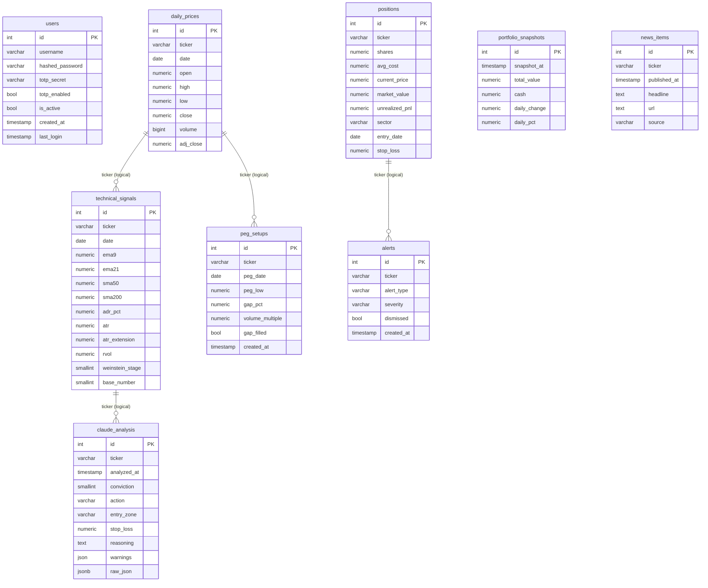

---

## 15. Python Concepts Map

| Concept | Location |
|---|---|
| `@dataclass` | `OHLCVBar`, `SignalSnapshot`, `PegCandidate`, `PositionMetrics`, `AccountSnapshot`, `TranchePlan`, `ExposureReport`, `SellSignal` |
| `@classmethod` | `PegScanner.from_settings()`, `AlpacaSync.from_settings()`, `PositionMetrics.compute()`, `DailyBriefing.from_singletons()` |
| `@staticmethod` | `PegScanner.check_gap_filled()`, `PositionSizer.calc_stop_from_peg/sma50`, `StopManager._write_stage()` |
| `ABC` + `@abstractmethod` | `BaseScreener` (all screeners), `BaseAnalyzer` (ClaudeAnalyzer) |
| Inheritance | `TechnicalAnalyzer/PegScanner/BaseDetector/StageAnalyzer → BaseScreener`, `ClaudeAnalyzer → BaseAnalyzer` |
| Pydantic `BaseSettings` | `Settings` in `settings.py` |
| `@computed_field` | `Settings.rh_enabled` |
| Pydantic `BaseModel` | All schemas in `schemas/responses.py`, `auth/schemas.py` |
| `Enum` (str) | `SignalType`, `Severity`, `TokenType` |
| `NamedTuple` | `SectorLeader` |
| Generator function | `PriceDataFetcher._iter_bars`, `_to_dict_gen`, `UniverseScorer._score_gen`, `ExposureCalculator._sector_warnings` |
| `defaultdict` | `ExposureCalculator.calc_exposure`, `DailyBriefing.generate`, movers endpoint |
| `Counter` | `UniverseScorer.rank_universe` (stage/action dist), `DailyBriefing.generate` |
| `deque(maxlen=N)` | `TradingScheduler._run_history` |
| `asyncio.gather` | `ClaudeAnalyzer.run_all_async` |
| `asyncio.Semaphore` | Concurrency cap in `run_all_async` |
| `asyncio.wait_for` | Per-ticker timeout in `analyze_ticker_async` |
| `asyncio.create_task` | Fire-and-forget DB saves in `run_all_async` |
| `run_in_executor` | Bridging sync SQLAlchemy into async loop |
| `@contextmanager` | `managed_session()` in `database.py` |
| `@tenacity.retry` | `NewsFetcher._fetch_with_retry`, `SlackNotifier._post_with_retry` |
| `*args/**kwargs` | `TradingAgentError.__init__(**kwargs)`, scheduler `_add` wrapper closure |
| List/dict comprehension | Throughout all modules |
| Type hints everywhere | All files use `from __future__ import annotations` |

---

## 16. Design Patterns

| Pattern | Where used | Why |
|---|---|---|
| **Singleton** | Every module exports an instance (`price_fetcher`, `stop_manager`, etc.) | Single shared state, no repeated instantiation |
| **Template Method** | `BaseScreener.run_all()` abstract + `_log_result()` concrete | Shared logging, enforced interface |
| **Factory Method** | `.from_settings()` classmethods | Decouples construction from configuration |
| **Strategy** | `BaseAnalyzer` with swappable implementations | Can replace `ClaudeAnalyzer` with any other AI |
| **Dependency Injection** | `DailyBriefing` constructor, FastAPI `Depends()` | Testable, mockable |
| **Context Manager** | `managed_session()` | Guaranteed rollback + close |
| **Decorator** | `@tenacity.retry` on HTTP calls | Retry logic separated from business logic |
| **Observer** (partial) | `StopManager → Slack → DB` | Risk events trigger notifications |
| **Repository** (lightweight) | Each class owns its DB queries | Encapsulated data access |
