# Frontend — Low-Level Design

> React 18 + TypeScript + Vite — all server state managed by TanStack Query, zero Redux, dark-mode Tailwind design system.

---

## Table of Contents

1. [Application Structure](#1-application-structure)
2. [Technology Stack](#2-technology-stack)
3. [Routing Architecture](#3-routing-architecture)
4. [Component Tree](#4-component-tree)
5. [Type System](#5-type-system)
6. [API Client](#6-api-client)
7. [Hooks Architecture](#7-hooks-architecture)
8. [Pages — Detailed Breakdown](#8-pages--detailed-breakdown)
9. [Layout Components](#9-layout-components)
10. [Chart Components](#10-chart-components)
11. [Table Components](#11-table-components)
12. [Shared Components](#12-shared-components)
13. [Auth Flow (Frontend)](#13-auth-flow-frontend)
14. [State Management](#14-state-management)
15. [Design System](#15-design-system)
16. [Data Flow Diagrams](#16-data-flow-diagrams)

---

## 1. Application Structure

```
frontend/src/
├── main.tsx                   App root — providers, QueryClient, Toaster
├── App.tsx                    BrowserRouter + all routes
├── index.css                  Tailwind base + custom .card, .tag classes
├── vite-env.d.ts              Vite env type declarations
│
├── api/
│   └── client.ts              Axios instance + all API namespace objects
│
├── types/
│   └── index.ts               All TypeScript interfaces (single source of truth)
│
├── utils/
│   ├── constants.ts           Sector colors, action styles, severity styles
│   └── formatters.ts          fmt.currency, fmt.pct, fmt.date, fmt.pnlColor
│
├── hooks/
│   ├── usePortfolio.ts        Portfolio + alerts queries and mutations
│   ├── useScreener.ts         Universe screener query
│   ├── useMovers.ts           Movers, volume, PEG, news queries
│   └── useAnalysis.ts         Single-ticker analysis + refresh mutation
│
├── pages/
│   ├── Dashboard.tsx          Home — KPIs, chart, donut, movers, alerts
│   ├── Portfolio.tsx          Holdings table + equity chart + sector donut
│   ├── Screener.tsx           Sortable screener table + filters
│   ├── Analysis.tsx           Single-ticker deep dive (Claude output)
│   ├── PegSetups.tsx          Active PEGs + PEG history tabs
│   ├── Movers.tsx             Gainers/losers + unusual volume + news
│   ├── SectorView.tsx         Heatmap + sector stats table
│   └── Playbook.tsx           Static trading rules reference
│
├── components/
│   ├── layout/
│   │   ├── Layout.tsx         Shell: sidebar + header + <Outlet>
│   │   ├── Sidebar.tsx        Fixed nav with NavLink active states
│   │   └── Header.tsx         Portfolio summary bar + alert badge
│   │
│   ├── charts/
│   │   ├── PortfolioChart.tsx  Recharts AreaChart — equity curve
│   │   ├── SectorDonut.tsx     Recharts PieChart — sector allocation
│   │   ├── MiniSparkline.tsx   Recharts LineChart — inline price trend
│   │   ├── ConvictionBar.tsx   Segmented score bar + ScoreCircle
│   │   └── HeatmapGrid.tsx     CSS grid tiles — sector performance
│   │
│   ├── tables/
│   │   ├── HoldingsTable.tsx   Expandable rows — open positions
│   │   ├── ScreenerTable.tsx   Sortable — full universe ranking
│   │   └── MoversTable.tsx     Gainers/losers with inline bar charts
│   │
│   └── shared/
│       ├── Badge.tsx           ActionBadge, SeverityBadge, StageBadge
│       ├── MetricCard.tsx      KPI card (label, value, sub, icon, trend)
│       └── LoadingSkeleton.tsx Skeleton, CardSkeleton, TableSkeleton, EmptyState
```

---

## 2. Technology Stack

| Technology | Version | Role |
|---|---|---|
| React | 18 | Component model, Concurrent features |
| TypeScript | 5.x | Full type safety across components and hooks |
| Vite | 5.x | HMR dev server, optimised production bundles |
| React Router | v6 | Nested routes, `<Outlet>`, `useParams`, `NavLink` |
| TanStack Query | v5 | Server-state cache, background refetch, `useQuery`, `useMutation` |
| Axios | 1.x | HTTP client with response interceptor for error normalisation |
| Recharts | 2.x | `AreaChart`, `PieChart`, `LineChart` — all responsive |
| Tailwind CSS | 3.x | Utility-first, dark-mode, no runtime CSS |
| Lucide React | latest | Consistent icon set (SVG, tree-shakeable) |
| react-hot-toast | 2.x | Mutation feedback toasts |
| clsx | latest | Conditional className joining |

---

## 3. Routing Architecture

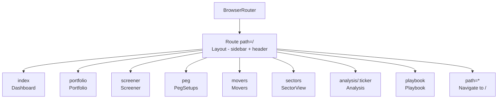

All routes share the `Layout` shell via React Router v6 nested routes and `<Outlet>`. The wildcard redirects unknown paths to Dashboard.

`Analysis` receives `ticker` via `useParams<{ ticker: string }>()` and passes it to `useAnalysis(ticker)`.

---

## 4. Component Tree

```
App
└── BrowserRouter
    └── QueryClientProvider
        └── Layout
            ├── Sidebar (fixed left, w-52)
            │   ├── Logo
            │   ├── NavLink × 6 (main nav)
            │   ├── NavLink × 1 (learn nav)
            │   └── Market status pulse
            ├── Header (fixed top, h-16)
            │   ├── Portfolio value + daily%
            │   ├── Quick stats (3×)
            │   ├── Alert bell (badge count)
            │   └── Avatar
            └── <main> → <Outlet>
                ├── Dashboard
                │   ├── MetricCard × 4
                │   ├── PortfolioChart
                │   ├── SectorDonut
                │   ├── MoversTable (top 5)
                │   └── Alert chips
                ├── Portfolio
                │   ├── MetricCard × 4
                │   ├── HoldingsTable
                │   ├── PortfolioChart
                │   └── SectorDonut
                ├── Screener
                │   ├── Filters (sector + min_score)
                │   └── ScreenerTable
                ├── Analysis
                │   ├── ConvictionBar
                │   ├── ActionBadge + StageBadge
                │   ├── PortfolioChart (price history)
                │   └── Technicals grid
                ├── PegSetups
                │   ├── Tab: Active PEGs
                │   └── Tab: PEG History
                ├── Movers
                │   ├── MoversTable (gainers/losers)
                │   ├── Unusual volume list
                │   └── News feed
                ├── SectorView
                │   ├── HeatmapGrid
                │   └── Sector stats table
                └── Playbook (static)
└── Toaster (position: top-right)
```

---

## 5. Type System

All types live in `src/types/index.ts` — single source of truth, zero duplication.

```typescript
// Portfolio domain
interface PortfolioSummary { total_value, total_pnl, daily_change, daily_pct, position_count, cash? }
interface Position { ticker, shares, avg_cost, current_price, market_value, unrealized_pnl, unrealized_pct, sector, entry_date?, stop_loss?, tranche1_filled, tranche2_filled }
interface SectorAllocation { sector_pcts: Record<string, number>, correlated: Record<string, number>, warnings: string[] }

// Screener domain
interface ScreenerRow { ticker, sector, technical, setup, fundamental, total, action, stage, base_number, adr_pct, atr_extension, rvol, peg_active }

// Analysis domain
interface Analysis { id, ticker, analyzed_at, conviction, action, entry_zone, stop_loss, risk_reward, stage, base_number, reasoning, warnings, raw_json }

// PEG domain
interface PegSetup { id, ticker, peg_date, peg_low, gap_pct, volume_multiple, gap_filled, created_at, sector?, current_price?, entry_zone? }

// Movers domain
interface Mover { ticker, price, change_pct, volume?, avg_volume?, rvol?, sector? }
interface MoversResponse { gainers: Mover[], losers: Mover[] }

// Literal types (compile-time safety)
type Action   = 'BUY' | 'ADD' | 'HOLD' | 'TRIM' | 'SELL' | 'WATCH'
type Severity = 'critical' | 'warning' | 'info'
type Sector   = 'AI_SOFTWARE' | 'SEMICONDUCTORS' | 'MEMORY' | 'SPACE_DEFENSE' | 'PHYSICAL_AI_ROBOTICS'
```

---

## 6. API Client

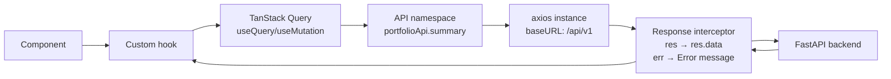

**Axios instance config:**
```typescript
const api = axios.create({
  baseURL: '/api/v1',
  timeout: 15_000,
  headers: { 'Content-Type': 'application/json' },
})
// Interceptor unwraps .data and normalises errors to Error objects
```

**JWT injection:** After login, `axios.defaults.headers.common['Authorization'] = \`Bearer ${token}\`` is set. All subsequent requests include the token automatically.

**Namespaces exported:**

| Namespace | Methods |
|---|---|
| `portfolioApi` | `summary()`, `holdings()`, `sectorAlloc()`, `performance(period)` |
| `screenerApi` | `ranked(sector, minScore)` |
| `analysisApi` | `get(ticker)`, `refresh(ticker)` |
| `pegApi` | `active()`, `history()` |
| `moversApi` | `top(count)`, `unusual(threshold)` |
| `newsApi` | `feed(sector, limit)` |
| `alertsApi` | `active()`, `dismiss(id)` |
| `systemApi` | `health()`, `runPipeline()` |

---

## 7. Hooks Architecture

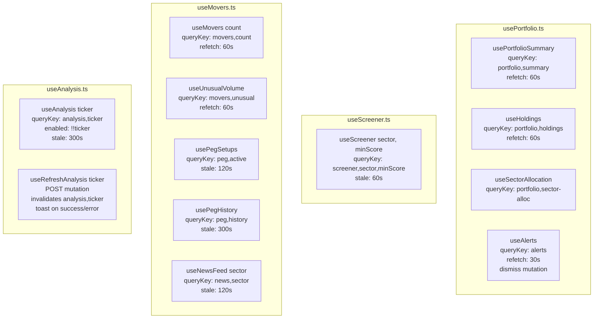

**Cache key strategy:** Every filter parameter is included in the query key. `useScreener('AI_SOFTWARE', 60)` and `useScreener('all', 0)` are cached independently. Changing a filter doesn't invalidate the other cached result.

**Stale-time rationale:**

| Hook | Stale time | Why |
|---|---|---|
| `usePortfolioSummary` | 60s refetch | Portfolio changes intraday |
| `useAlerts` | 30s refetch | Risk alerts need near-real-time |
| `useScreener` | 60s stale | Scores change daily, not by the second |
| `useAnalysis` | 300s stale | Claude analysis is expensive + stable |
| `usePegHistory` | 300s stale | Historical data, rarely changes |

---

## 8. Pages — Detailed Breakdown

### Dashboard

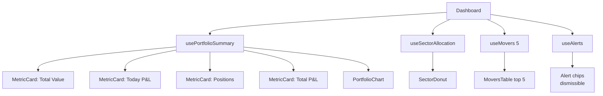

**Loading state:** While `isLoading` is true, renders `CardSkeleton × 4` in the KPI row. Prevents layout shift.

**Alert chips:** Filtered to `!a.dismissed`, coloured by `SEVERITY_STYLES[a.severity]`, clicking calls `dismiss(a.id)` mutation which on success invalidates `['alerts']`.

---

### Screener

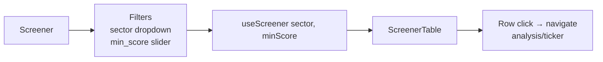

**Filter flow:** Both filters drive the `useScreener` query key. The sector filter is passed to the API (`?sector=AI_SOFTWARE`). The `min_score` filter is applied client-side after data loads (avoids API calls on every slider move).

---

### Analysis

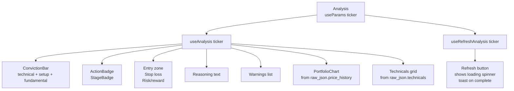

**Price history data:** Embedded in `raw_json.price_history` by the backend's `_enrich()` helper — a list of `{date, close}` objects spanning 90 days. Passed directly to `PortfolioChart` as the `data` prop.

---

### PegSetups

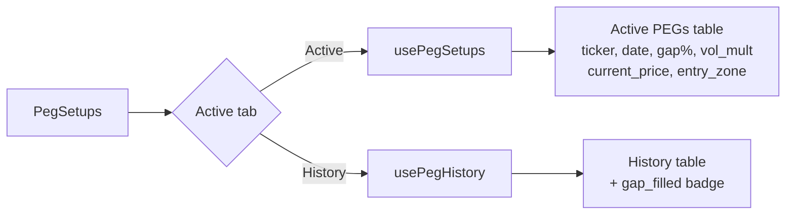

---

### Movers

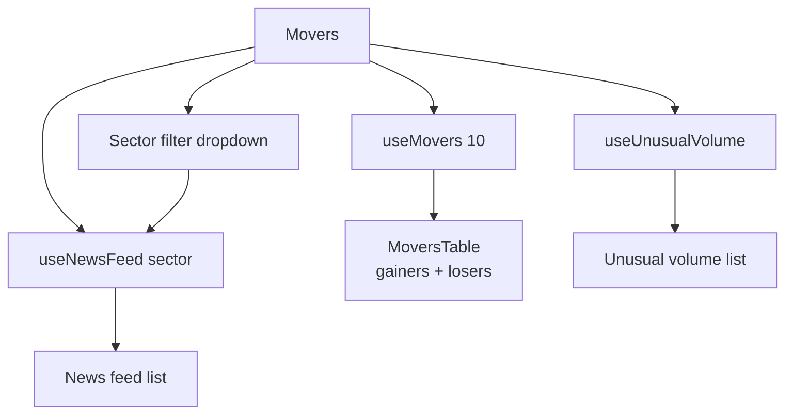

---

### SectorView

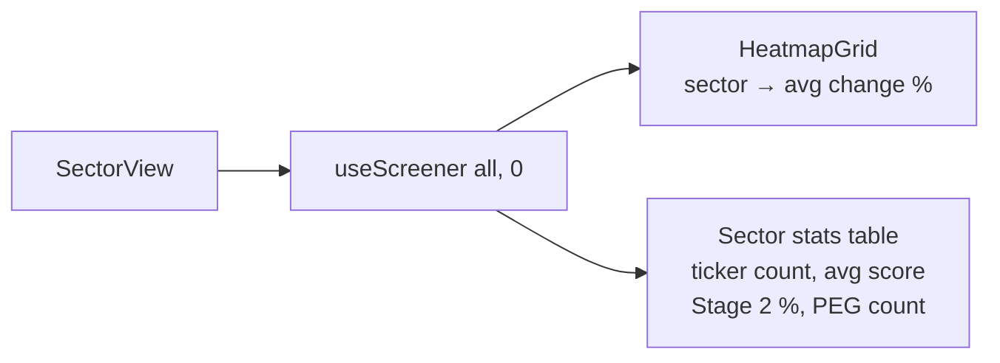

**Heatmap data derivation:** The screener ranking data is aggregated client-side — grouped by sector, averaging total scores, counting Stage 2 stocks and active PEGs.

---

## 9. Layout Components

### `Sidebar`

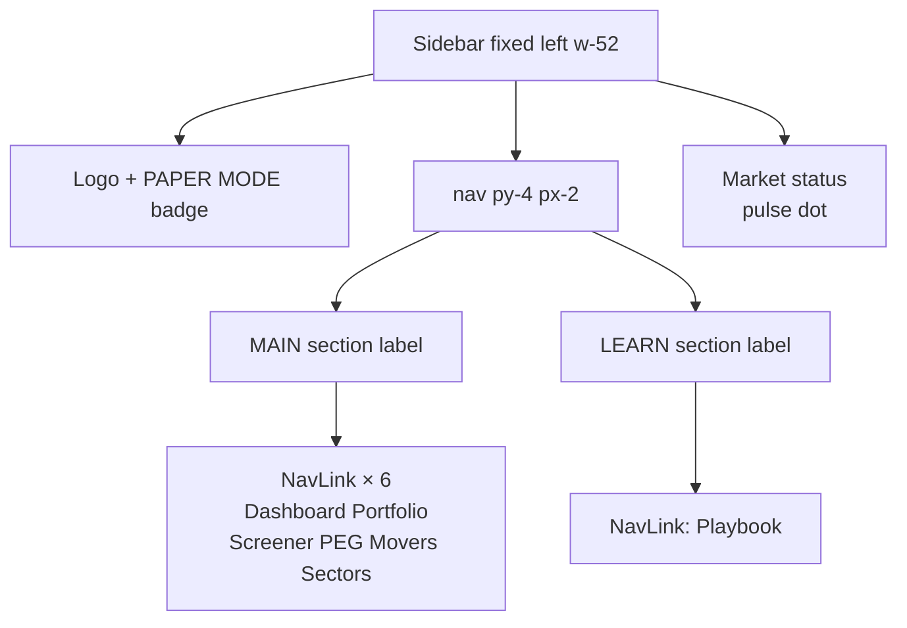

`NavLink` uses `({ isActive }) => clsx(...)` to apply `bg-blue-600/20 text-blue-400` on the active route. `end={to === '/'}` prevents Dashboard from matching all child routes.

### `Header`

- Reads `usePortfolioSummary()` and `useAlerts()` — shares the cache with Dashboard (zero extra requests)
- Alert bell shows count badge in red circle when `alerts.filter(!dismissed).length > 0`
- Avatar shows initials "CR" (static — single user)

---

## 10. Chart Components

### `PortfolioChart`

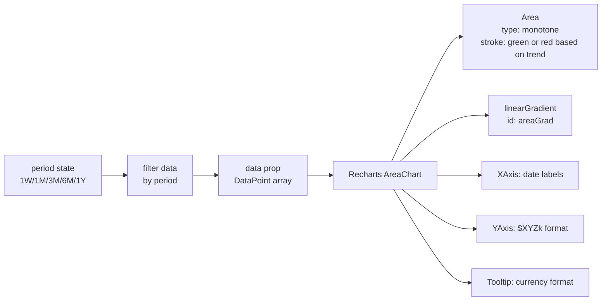

**Gradient fill:** Computed from `isUp = last >= first`. Green gradient when period return is positive, red when negative.

**Fallback:** When `data` prop is undefined (no snapshots in DB yet), renders MOCK data (90 days of simulated equity curve) so the chart always shows something.

---

### `SectorDonut`

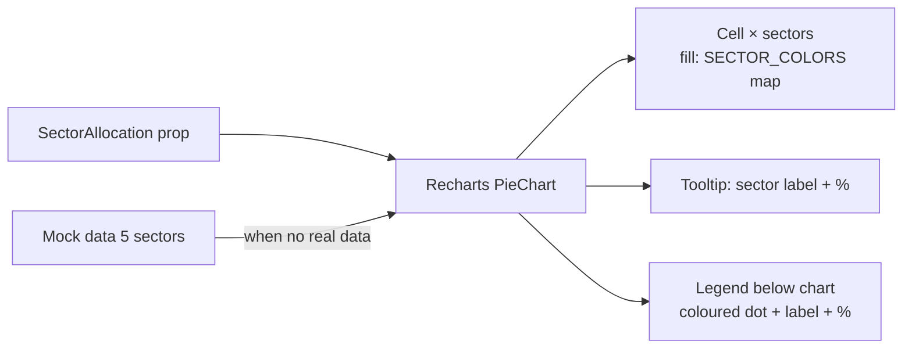

Inner radius 55, outer radius 82 — donut style. `paddingAngle={3}` creates visual separation between slices.

---

### `ConvictionBar`

```
[Technical████████░░░░] [Setup██████░░░░░░] [Fundamental████░░░░░░░] [Remainder░░░░░]
  blue                   violet               cyan                     slate-800
```

Three segments sized proportionally by score value (0–40, 0–30, 0–30). The remainder fills to 100%. Tooltip-enabled via native `title` attributes.

`ScoreCircle` variant — circular badge with coloured border:
- ≥ 70: `border-emerald-400 text-emerald-400`
- ≥ 50: `border-amber-400 text-amber-400`
- < 50: `border-red-400 text-red-400`

---

### `HeatmapGrid`

```
┌──────────────┬──────────────┬──────────────┐
│ AI/Software  │ Semis        │ Space        │
│  +1.8%  🟢   │  +2.1%  🟢   │  +3.4%  🟩   │
├──────────────┼──────────────┼──────────────┤
│ Memory       │ Robotics     │              │
│  -0.3%  🟥   │  +0.9%  🟡   │              │
└──────────────┴──────────────┴──────────────┘
```

6 colour bands: `bg-emerald-500` (≥ +3%) → `bg-emerald-700/70` → `bg-emerald-900/40` → `bg-red-900/40` → `bg-red-700/70` → `bg-red-500` (≤ −3%).

---

## 11. Table Components

### `HoldingsTable`

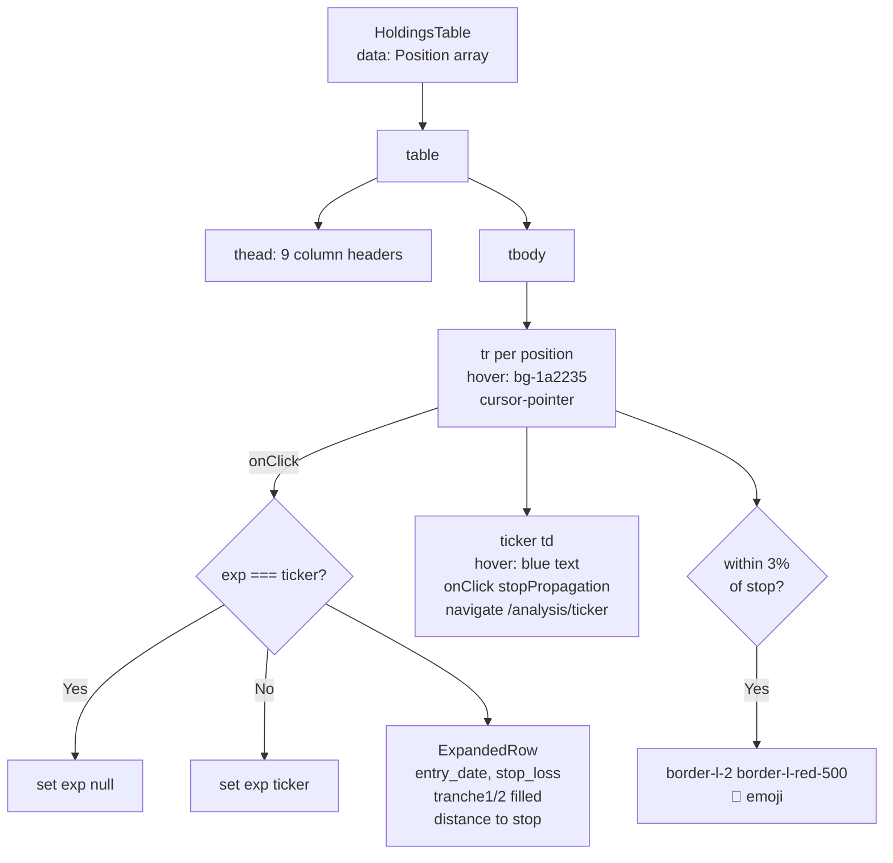

**Expandable rows:** `exp: string | null` state tracks which ticker is expanded. Only one row open at a time. Expand icon toggles between `ChevronRight` and `ChevronDown`.

**Distance to stop colouring:**
- < 3%: `text-red-400`
- < 7%: `text-amber-400`
- ≥ 7%: `text-slate-300`

---

### `ScreenerTable`

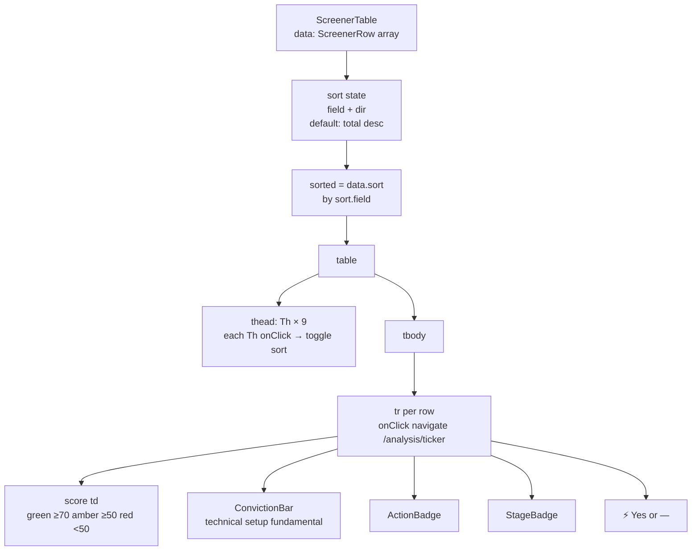

**Sort toggle logic:** Clicking the same column toggles `asc` ↔ `desc`. Clicking a different column sets `desc` (always start descending).

Sticky `thead` with `bg-[#111827]` ensures headers stay visible while scrolling long tables.

---

### `MoversTable`

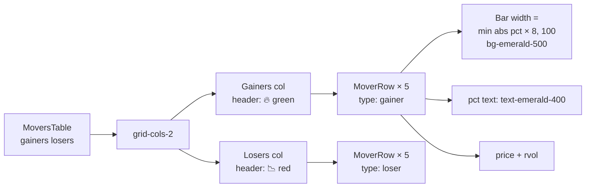

Bar width formula: `Math.min(Math.abs(change_pct) * 8, 100)%` — 12.5% move fills the bar.

---

## 12. Shared Components

### `Badge`

| Component | Props | Colours from |
|---|---|---|
| `ActionBadge` | `action: Action` | `ACTION_STYLES` map in constants.ts |
| `SeverityBadge` | `severity: Severity, label?` | `SEVERITY_STYLES` map |
| `StageBadge` | `stage: number` | Inline record in component |

All three apply `.tag border` base class + `{ bg, text, border }` from the style map.

### `MetricCard`

```typescript
interface Props {
  label:      string
  value:      string | number
  sub?:       string           // secondary metric
  subColor?:  string           // Tailwind class
  icon?:      LucideIcon       // tinted background circle
  iconColor?: string
  trend?:     number | null    // shows ▲▼ with value
}
```

### `LoadingSkeleton`

- `Skeleton` — base animated grey rectangle, sized by className
- `CardSkeleton` — 3-row skeleton matching MetricCard dimensions
- `TableSkeleton` — N full-width row skeletons (default 8)
- `EmptyState` — centred icon + title + subtitle for zero-data states

---

## 13. Auth Flow (Frontend)

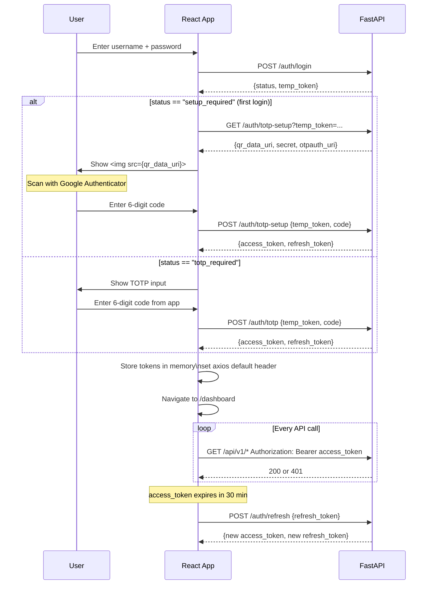

**Token storage:** In-memory only (React state / Axios defaults). Not in `localStorage` or cookies — mitigates XSS. Tokens are lost on page refresh (user must re-login — acceptable for a personal single-user tool).

---

## 14. State Management

This app has **no global client state** (no Redux, no Zustand). All state is one of:

| State type | Where it lives | Example |
|---|---|---|
| Server state | TanStack Query cache | Portfolio, screener, alerts |
| URL state | React Router params | `ticker` in `/analysis/:ticker` |
| Local UI state | `useState` in component | `sort`, `exp`, `period`, `tab` |
| Form state | `useState` or uncontrolled | Login inputs, filter inputs |

**TanStack Query configuration (`main.tsx`):**
```typescript
const queryClient = new QueryClient({
  defaultOptions: {
    queries: {
      retry: 1,                  // one retry on network error
      staleTime: 30_000,         // data fresh for 30s
      refetchOnWindowFocus: false // no surprise refetches
    }
  }
})
```

**Cache invalidation:** Mutations call `queryClient.invalidateQueries({ queryKey: [...] })` on success — TanStack Query refetches in the background without blocking the UI.

---

## 15. Design System

### Colour Palette (Tailwind custom + bg overrides)

| Token | Hex | Usage |
|---|---|---|
| Background | `#0a0e17` | Page background |
| Card | `#111827` | All `.card` surfaces |
| Border | `#1e293b` | Card borders, table dividers |
| Header/Sidebar | `#0d1321` | Fixed surfaces |
| Hover | `#1a2235` | Table rows, nav items |
| Text primary | `#e2e8f0` (slate-200) | Headings, values |
| Text secondary | `#94a3b8` (slate-400) | Labels, muted |
| Text faint | `#475569` (slate-600) | Column headers |
| Gain | `#10b981` (emerald-400) | Positive P&L |
| Loss | `#ef4444` (red-400) | Negative P&L |
| Buy/Stage2 | `#10b981` | Buy signals, Stage 2 |
| Warning | `#f59e0b` (amber-400) | Stage 3, near-stop |
| Critical | `#ef4444` | Stage 4, stop-hit |

### Sector Colours (used in donut + heatmap)

| Sector | Colour |
|---|---|
| AI_SOFTWARE | `#8b5cf6` (violet) |
| SEMICONDUCTORS | `#06b6d4` (cyan) |
| MEMORY | `#3b82f6` (blue) |
| SPACE_DEFENSE | `#10b981` (emerald) |
| PHYSICAL_AI_ROBOTICS | `#f59e0b` (amber) |

### Custom CSS Classes (`index.css`)

```css
.card  { @apply bg-[#111827] border border-[#1e293b] rounded-xl; }
.tag   { @apply px-2 py-0.5 rounded-md text-xs font-medium; }
```

### Typography

- **Body**: DM Sans (sans-serif)
- **Numbers/Mono**: System monospace (`font-mono`)
- **Column headers**: 10px, uppercase, tracking-widest, slate-500
- **Values**: 24px semi-bold mono (MetricCard primary)
- **Sub-values**: 14px mono (MetricCard secondary)

---

## 16. Data Flow Diagrams

### Dashboard Load Flow

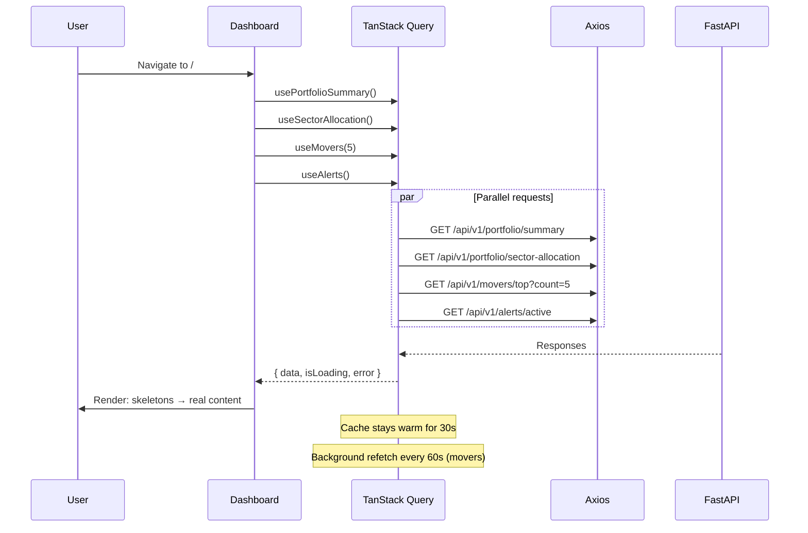

### Alert Dismiss Flow

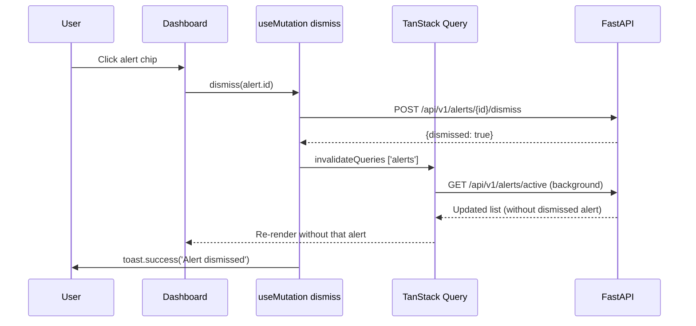

### Screener Filter + Sort Flow

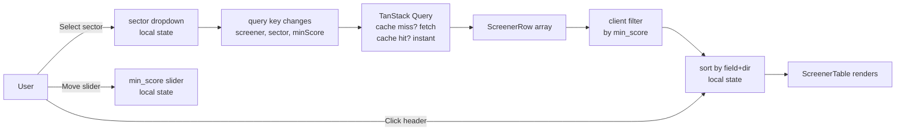
