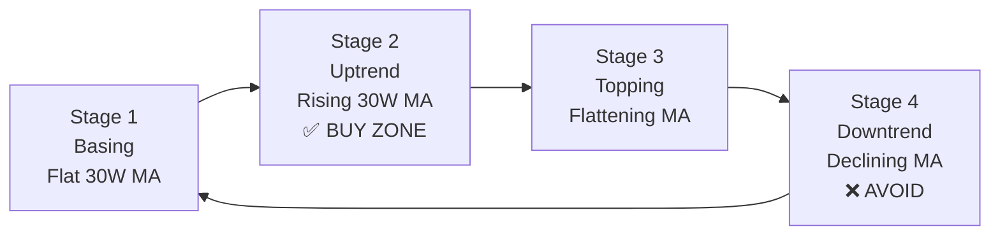
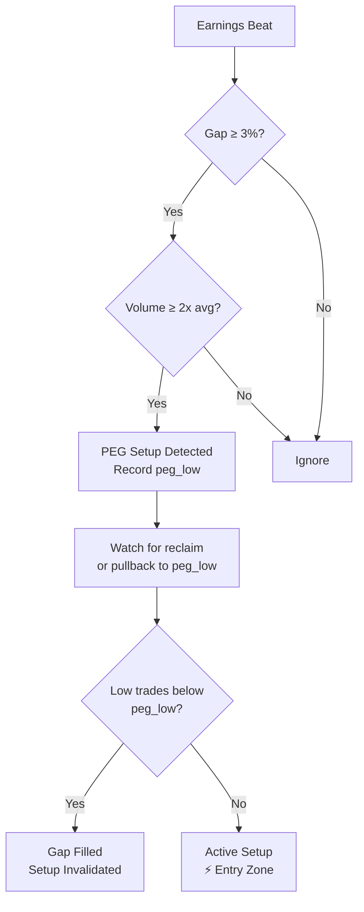
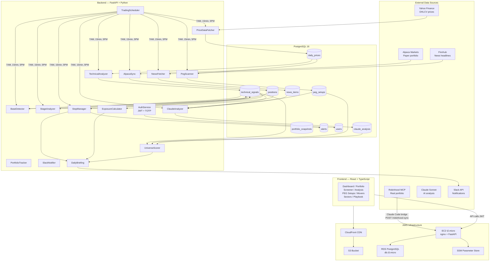
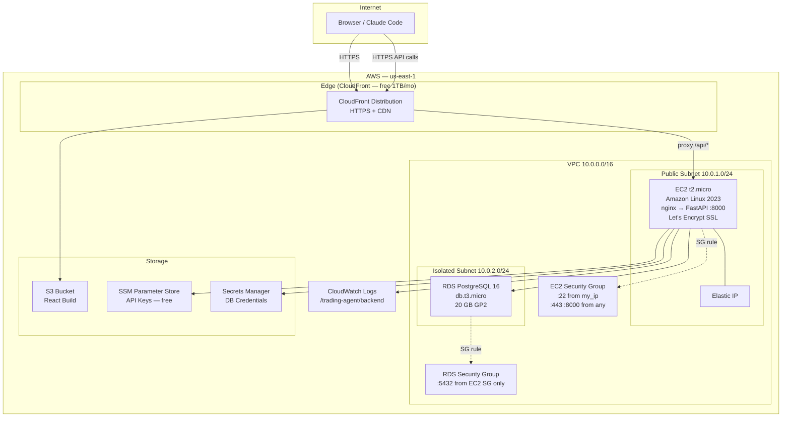
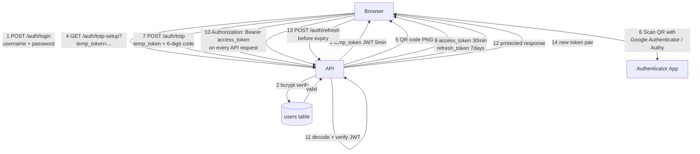
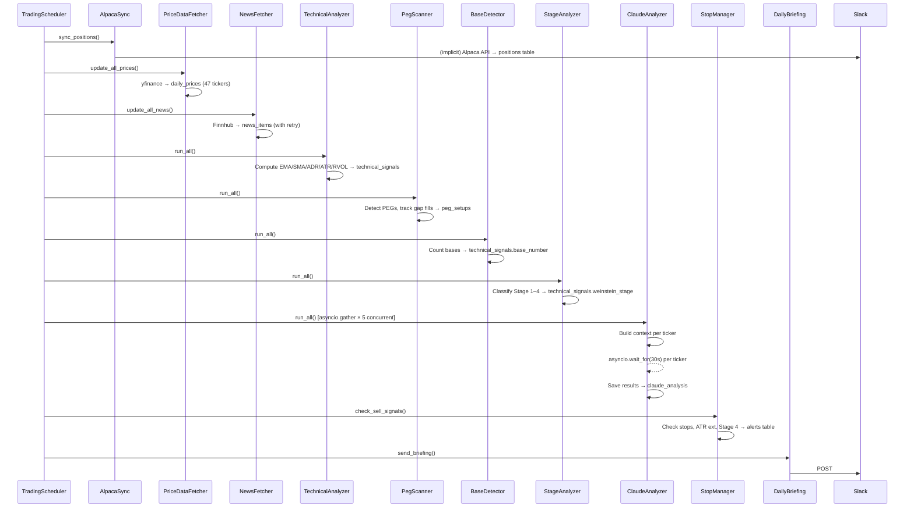
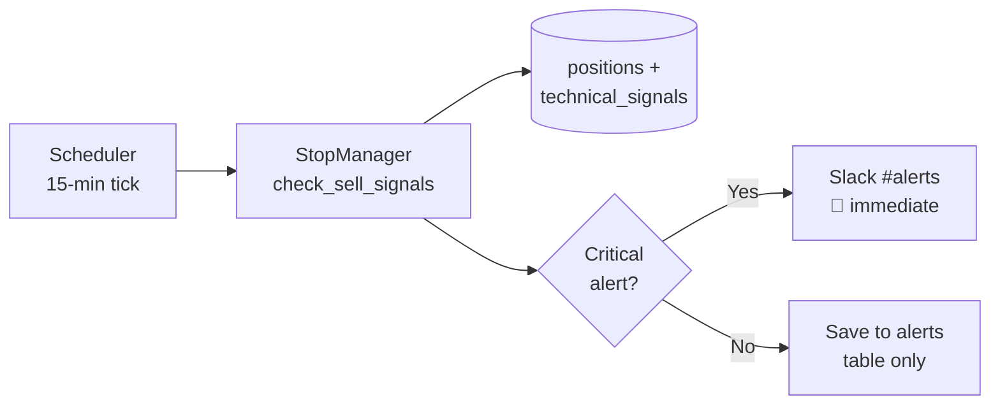
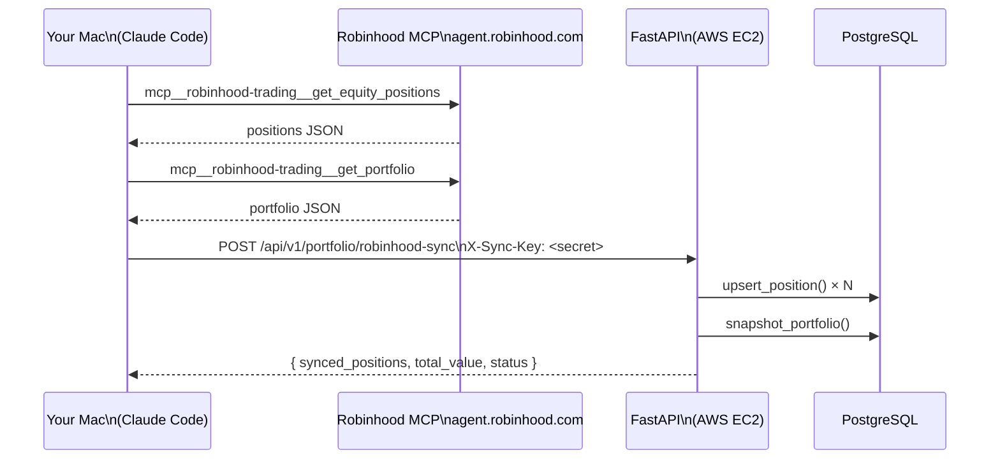
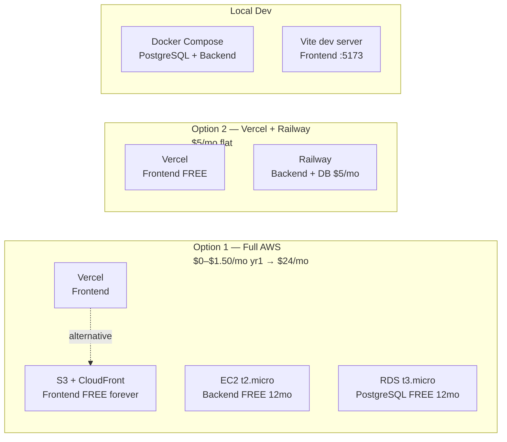

# Trading Agent — High-Level Design

> An AI-powered growth stock analysis platform that applies William O'Neil's CANSLIM methodology and Stan Weinstein Stage Analysis to a curated universe of high-growth tech stocks. Claude AI provides structured trade recommendations; a React dashboard surfaces them in real time.

---

## Table of Contents

1. [Project Purpose](#1-project-purpose)
2. [Trading Strategy Overview](#2-trading-strategy-overview)
3. [System Architecture](#3-system-architecture)
4. [Component Overview](#4-component-overview)
5. [Technology Choices & Rationale](#5-technology-choices--rationale)
6. [Infrastructure Topology](#6-infrastructure-topology)
7. [Security Model](#7-security-model)
8. [Key System Flows](#8-key-system-flows)
9. [External Integrations](#9-external-integrations)
10. [Deployment Options](#10-deployment-options)
11. [Cost Model](#11-cost-model)

---

## 1. Project Purpose

The trading agent automates the most time-consuming parts of a CANSLIM growth-stock workflow:

| Manual today | Automated by this system |
|---|---|
| Scan 47+ tickers for technical setups | `TechnicalAnalyzer` computes all signals nightly |
| Identify Power Earnings Gap patterns | `PegScanner` flags PEG events and tracks gap fills |
| Classify Weinstein stages | `StageAnalyzer` classifies each ticker 1–4 |
| Count O'Neil consolidation bases | `BaseDetector` counts valid bases per ticker |
| Research news and fundamentals | `NewsFetcher` pulls Finnhub headlines; Claude synthesises |
| Write a trade thesis | `ClaudeAnalyzer` produces structured JSON reasoning |
| Rank the universe by opportunity | `UniverseScorer` scores every ticker 0–100 |
| Monitor stop losses | `StopManager` fires real-time Slack alerts |
| Morning briefing | `DailyBriefing` sends a formatted Slack summary at 7 AM PT |

The system does **not** place trades automatically. It is a decision-support tool — all execution is manual.

---

## 2. Trading Strategy Overview

### CANSLIM (William O'Neil)

```
C — Current quarterly earnings (accelerating)
A — Annual earnings growth (25%+ over 3 years)
N — New products, new highs, new management
S — Supply and demand (volume on breakouts)
L — Leader or laggard (relative strength)
I — Institutional sponsorship
M — Market direction (only buy in confirmed uptrends)
```

### Weinstein Stage Analysis



### Power Earnings Gap (PEG)

A PEG is a gap-up of ≥ 3% on volume ≥ 2× the 20-day average, typically triggered by a positive earnings surprise. The gap low becomes a key support level — if price holds above it, the setup remains valid.



### Entry Rules

- **Stage 2 only** (Weinstein)
- **ADR 3–10%** (volatile enough to move, not wild)
- **ATR extension < 2×** (not overextended from 50 SMA)
- **RVOL > 1.5×** on entry day
- Two tranches: 5% + 5% of portfolio (max 10% per position)

### Exit Rules

- Stop hit → exit immediately
- Within 3% of stop → alert
- ATR extension ≥ 3× → trim 1/3
- Base 3 or 4 → watch for climax top
- Stage 4 → mandatory exit

---

## 3. System Architecture



---

## 4. Component Overview

| Layer | Component | Responsibility |
|---|---|---|
| **Core** | `Settings` | Type-safe env loading via Pydantic BaseSettings |
| **Core** | `database.py` | Engine, session factory, `managed_session()` context manager |
| **Core** | `exceptions.py` | Custom exception hierarchy under `TradingAgentError` |
| **Data** | `PriceDataFetcher` | Download + persist OHLCV from Yahoo Finance |
| **Data** | `NewsFetcher` | Fetch + deduplicate news from Finnhub (tenacity retries) |
| **Data** | `RobinhoodReader` | Optional bridge to real Robinhood portfolio |
| **Screener** | `TechnicalAnalyzer` | Compute 10 indicators (EMA, SMA, ADR, ATR, RVOL) |
| **Screener** | `PegScanner` | Detect PEG events, track gap fills |
| **Screener** | `BaseDetector` | Count O'Neil consolidation bases |
| **Screener** | `StageAnalyzer` | Classify Weinstein Stage 1–4 |
| **Analysis** | `ClaudeAnalyzer` | Async parallel Claude API calls with timeout + semaphore |
| **Analysis** | `UniverseScorer` | 0–100 composite score; sector leadership |
| **Portfolio** | `PortfolioTracker` | Upsert positions, snapshot P&L |
| **Portfolio** | `AlpacaSync` | Sync Alpaca paper account → local DB |
| **Risk** | `StopManager` | Stop hits, ATR extension, Stage 4 alerts |
| **Risk** | `ExposureCalculator` | Sector % + correlated group exposure |
| **Risk** | `PositionSizer` | Two-tranche sizing from portfolio value |
| **Alerts** | `SlackNotifier` | Post to Slack channels with tenacity retries |
| **Alerts** | `DailyBriefing` | Assemble + send morning report |
| **Scheduler** | `TradingScheduler` | APScheduler: morning, intraday, evening jobs |
| **Auth** | `AuthService` | bcrypt passwords, TOTP (pyotp), JWT (jose) |

---

## 5. Technology Choices & Rationale

### Why FastAPI over Flask/Django?
- Native `async/await` — critical for parallel Claude calls
- Pydantic integration — automatic request/response validation
- Auto-generated OpenAPI docs at `/docs`
- Performance: Starlette ASGI, fastest Python web framework

### Why Claude over GPT-4?
- Structured JSON output is more reliable
- Longer context window for rich stock context
- `AsyncAnthropic` client enables `asyncio.gather` parallelism
- Already using Claude Code in the dev workflow

### Why PostgreSQL over SQLite?
- Concurrent reads from scheduler + API + dashboard
- `NUMERIC` type for exact financial arithmetic
- `JSONB` for Claude's raw output (indexed, queryable)
- RDS managed service for production

### Why APScheduler over Celery?
- No Redis broker needed
- Runs inside the FastAPI process (single service to deploy)
- `BackgroundScheduler` uses threads — compatible with sync SQLAlchemy
- Cron triggers with market-hours awareness

### Why direct Anthropic SDK over LangChain?
- Our workflow is deterministic (fixed pipeline steps)
- Claude is a data enrichment step, not an agent controlling flow
- Direct SDK: full visibility, no hidden abstractions
- LangChain overhead unnecessary for one-shot structured calls

### Why TanStack Query over Redux/Zustand?
- All state is server-state (no client-only state needed)
- Automatic background refetch, stale-while-revalidate
- Per-query cache keys with automatic invalidation
- Zero boilerplate vs Redux

---

## 6. Infrastructure Topology



### Network security model

- **EC2 in public subnet** — needs internet egress to reach Anthropic, Finnhub, Alpaca, Slack APIs. NAT Gateway (~$33/month) avoided by placing EC2 with public IP in a subnet with internet gateway.
- **RDS in isolated subnet** — no internet route. Only reachable from EC2's security group on port 5432. Not accessible from the internet under any path.
- **Security group as firewall** — SSH restricted to your home IP. API port accessible from anywhere (CloudFront acts as the entry point in production).
- **All API keys in SSM Parameter Store** — never in code, never in git, pulled at EC2 boot.

---

## 7. Security Model



| Layer | Mechanism |
|---|---|
| Password storage | bcrypt hash (cost factor 12) |
| TOTP | RFC 6238 TOTP via pyotp, 1-window drift tolerance |
| Access token | HS256 JWT, 30-minute expiry |
| Refresh token | HS256 JWT, 7-day expiry |
| Temp token | HS256 JWT, 5-minute expiry (between password OK and TOTP) |
| API protection | All `/api/v1/*` routes require `Authorization: Bearer` |
| HTTPS | Let's Encrypt via Certbot on EC2, auto-renew |
| DB credentials | AWS Secrets Manager, auto-generated 32-char password |
| API keys | AWS SSM Parameter Store standard tier (free) |
| Robinhood sync | `X-Sync-Key` static secret header on the sync endpoint |

---

## 8. Key System Flows

### Morning Pipeline (7:00 AM PT, Mon–Fri)



### Intraday Alert Check (every 15 min, 6:30 AM–1:00 PM PT)



### Robinhood Real-Portfolio Sync (Option 1 Bridge)



---

## 9. External Integrations

| Service | What we use it for | Auth method | Rate limits |
|---|---|---|---|
| **Yahoo Finance** | OHLCV price history (yfinance library) | None (public) | Soft limits — staggered by ticker |
| **Finnhub** | Company news headlines | API key | 60 calls/min free tier |
| **Alpaca Markets** | Paper trading positions + account sync | API key + secret | 200 req/min |
| **Anthropic Claude** | Structured stock analysis (JSON) | API key | Token-based, async 5 parallel |
| **Slack** | Daily briefing + real-time alerts | Bot OAuth token | 1 msg/sec per channel |
| **Robinhood MCP** | Real portfolio data (read-only bridge) | OAuth via Claude Code | Session-based |

---

## 10. Deployment Options



| | Full AWS | Vercel + Railway | Local Dev |
|---|---|---|---|
| **Frontend** | S3 + CloudFront | Vercel | Vite :5173 |
| **Backend** | EC2 t2.micro | Railway | Uvicorn :8000 |
| **Database** | RDS t3.micro | Railway PostgreSQL | Docker postgres:16 |
| **Year 1 cost** | ~$1.50/mo | ~$5/mo | $0 |
| **After year 1** | ~$24/mo | ~$8/mo | $0 |
| **Complexity** | High (CDK) | Low | Zero |

---

## 11. Cost Model

### AWS Free Tier (Year 1)

| Resource | Free allowance | Notes |
|---|---|---|
| EC2 t2.micro | 750 hrs/month | ~31 days — effectively always on |
| RDS db.t3.micro | 750 hrs/month + 20 GB | Single AZ, no multi-AZ |
| S3 | 5 GB + 20K GET + 2K PUT | More than enough for React build |
| **CloudFront** | **1 TB + 10M req/month** | **PERMANENTLY FREE — not just 12 months** |
| ACM SSL | Unlimited | Free with CloudFront |
| SSM Parameter Store | Standard tier | Free forever |
| CloudWatch | 10 metrics + 10 alarms | Basic free tier |
| Elastic IP | Free when attached | $0.005/hr when unattached |
| Route53 Hosted Zone | $0.50/month | Only if adding custom domain |

### After 12 Months

| Resource | Monthly cost |
|---|---|
| EC2 t2.micro | ~$8.35 |
| RDS db.t3.micro | ~$14.40 |
| S3 (< 5 GB) | ~$0.12 |
| CloudFront | $0 (always free) |
| Route53 | $0.50 |
| Domain | ~$1.00 |
| **Total** | **~$24/month** |
